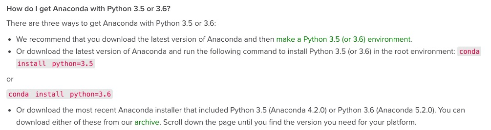
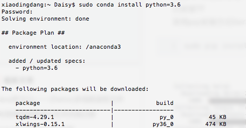
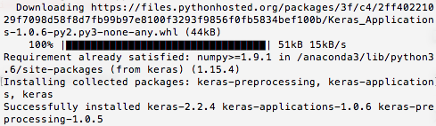
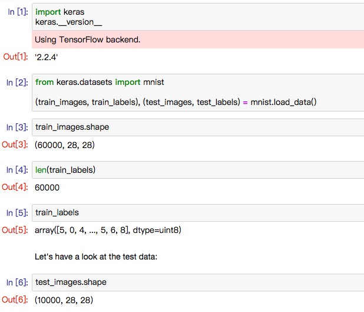

操作系统：macOs High Sierra 10.13.6

## 1. TensorFlow安装

**必备：Python**

采用pip方式安装TensorFlow，命令如下：

```
sudo pip install tensorflow
```

在输入该命令过程中遇到问题如下：（如无遇到可跳过）

```
Could not find a version that satisfies the requirement tensorflow ......
```

原因是**python版本问题**：最新的anaconda中python版本已经更新到python3.7，而tensorflow只支持到python3.6。

<!--more-->

在anaconda官网中给出了三种解决方案： 



选择第二种方案，在命令行输入如下命令：

```
sudo conda install python=3.6
```



python3.6安装完成。再如上输入命令，tensorflow安装完成。

## 2. Keras安装

采用pip方式安装Keras，命令如下：

```
sudo pip install keras
```



Keras安装完成。

## 3. 实例测试



