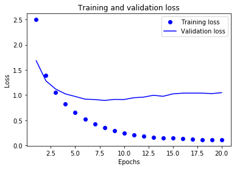
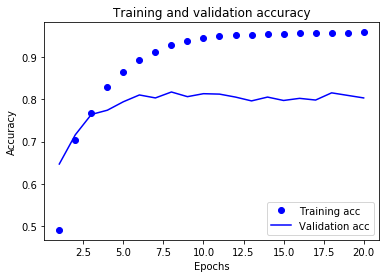

```python
#单标签 多分类
#加载路透社数据集
from keras.datasets import reuters
(train_data, train_labels), (test_data, test_labels) = reuters.load_data(num_words=10000)
```

```
Using TensorFlow backend.
```

```
Downloading data from https://s3.amazonaws.com/text-datasets/reuters.npz
2113536/2110848 [==============================] - 7s 3us/step
```

<!-- more -->

```python
len(train_data)
```


```
8982
```


```python
len(test_data)
```


```
2246
```


```python
train_data[10]
```


```
[1,
 245,
 273,
 207,
 156,
 53,
 74,
 160,
 26,
 14,
 46,
 296,
 26,
 39,
 74,
 2979,
 3554,
 14,
 46,
 4689,
 4329,
 86,
 61,
 3499,
 4795,
 14,
 61,
 451,
 4329,
 17,
 12]

```


```python
#将索引解码为新闻文本
word_index = reuters.get_word_index()
reverse_word_index = dict([(value, key) for (key, value) in word_index.items()])
decoded_newswire = ' '.join([reverse_word_index.get(i - 3, '?') for i in train_data[0]])
#第一个新闻

```

```
Downloading data from https://s3.amazonaws.com/text-datasets/reuters_word_index.json
557056/550378 [==============================] - 7s 13us/step

```


```python
train_labels[0]

```


```
3

```


```python
#数据向量化
import numpy as np
def vectorize_sequences(sequences, dimension=10000):
    results = np.zeros((len(sequences), dimension))
    for i, sequence in enumerate(sequences):
        results[i, sequence] = 1
    return results
x_train = vectorize_sequences(train_data)
x_test = vectorize_sequences(test_data)

```

```python
#标签向量化
def to_one_hot(labels, dimension=46):
    results = np.zeros((len(labels), dimension))
    for i, label in enumerate(labels):
        results[i, label] = 1
    return results

one_hot_train_labels = to_one_hot(train_labels)
one_hot_test_labels = to_one_hot(test_labels)

```

```python
#构建网络 模型定义
#激活函数 输出在46个不同输出类别上的概率分布
from keras import models
from keras import layers

model = models.Sequential()
model.add(layers.Dense(64, activation='relu', input_shape=(10000,)))
model.add(layers.Dense(64, activation='relu'))
model.add(layers.Dense(46, activation='softmax'))

```

```python
#编译模型
#分类交叉熵 衡量两个概率分布之间的距离
model.compile(optimizer='rmsprop', loss='categorical_crossentropy', metrics=['accuracy'])

```

```python
#留出验证集
x_val = x_train[:1000]
partial_x_train = x_train[1000:]

y_val = one_hot_train_labels[:1000]
partial_y_train = one_hot_train_labels[1000:]

```

```python
#训练模型
history = model.fit(partial_x_train, partial_y_train, epochs=20, batch_size=512, validation_data=(x_val, y_val))

```

```
Train on 7982 samples, validate on 1000 samples
Epoch 1/20
7982/7982 [==============================] - 4s 452us/step - loss: 2.4979 - acc: 0.4915 - val_loss: 1.6824 - val_acc: 0.6470
Epoch 2/20
7982/7982 [==============================] - 2s 264us/step - loss: 1.3942 - acc: 0.7045 - val_loss: 1.2821 - val_acc: 0.7160
Epoch 3/20
7982/7982 [==============================] - 2s 212us/step - loss: 1.0509 - acc: 0.7686 - val_loss: 1.1187 - val_acc: 0.7640
Epoch 4/20
7982/7982 [==============================] - 1s 175us/step - loss: 0.8256 - acc: 0.8281 - val_loss: 1.0233 - val_acc: 0.7740
Epoch 5/20
7982/7982 [==============================] - 1s 175us/step - loss: 0.6607 - acc: 0.8639 - val_loss: 0.9730 - val_acc: 0.7940
Epoch 6/20
7982/7982 [==============================] - 1s 188us/step - loss: 0.5260 - acc: 0.8928 - val_loss: 0.9196 - val_acc: 0.8100
Epoch 7/20
7982/7982 [==============================] - 1s 183us/step - loss: 0.4292 - acc: 0.9116 - val_loss: 0.9124 - val_acc: 0.8030
Epoch 8/20
7982/7982 [==============================] - 2s 201us/step - loss: 0.3498 - acc: 0.9270 - val_loss: 0.8942 - val_acc: 0.8170
Epoch 9/20
7982/7982 [==============================] - 2s 194us/step - loss: 0.2894 - acc: 0.9385 - val_loss: 0.9147 - val_acc: 0.8060
Epoch 10/20
7982/7982 [==============================] - 1s 181us/step - loss: 0.2451 - acc: 0.9453 - val_loss: 0.9124 - val_acc: 0.8130
Epoch 11/20
7982/7982 [==============================] - 1s 175us/step - loss: 0.2102 - acc: 0.9484 - val_loss: 0.9480 - val_acc: 0.8120
Epoch 12/20
7982/7982 [==============================] - 1s 173us/step - loss: 0.1881 - acc: 0.9523 - val_loss: 0.9600 - val_acc: 0.8050
Epoch 13/20
7982/7982 [==============================] - 2s 189us/step - loss: 0.1662 - acc: 0.9526 - val_loss: 0.9964 - val_acc: 0.7960
Epoch 14/20
7982/7982 [==============================] - 2s 229us/step - loss: 0.1530 - acc: 0.9550 - val_loss: 0.9766 - val_acc: 0.8050
Epoch 15/20
7982/7982 [==============================] - 2s 194us/step - loss: 0.1457 - acc: 0.9548 - val_loss: 1.0243 - val_acc: 0.7970
Epoch 16/20
7982/7982 [==============================] - 1s 176us/step - loss: 0.1332 - acc: 0.9553 - val_loss: 1.0392 - val_acc: 0.8020
Epoch 17/20
7982/7982 [==============================] - 1s 171us/step - loss: 0.1260 - acc: 0.9553 - val_loss: 1.0396 - val_acc: 0.7980
Epoch 18/20
7982/7982 [==============================] - 1s 183us/step - loss: 0.1169 - acc: 0.9560 - val_loss: 1.0390 - val_acc: 0.8150
Epoch 19/20
7982/7982 [==============================] - 1s 182us/step - loss: 0.1165 - acc: 0.9569 - val_loss: 1.0301 - val_acc: 0.8090
Epoch 20/20
7982/7982 [==============================] - 1s 177us/step - loss: 0.1140 - acc: 0.9580 - val_loss: 1.0484 - val_acc: 0.8030

```


```python
#绘制训练损失和验证损失
import matplotlib.pyplot as plt

loss = history.history['loss']
val_loss = history.history['val_loss']

epochs = range(1, len(loss) + 1)

plt.plot(epochs, loss, 'bo', label='Training loss')
plt.plot(epochs, val_loss, 'b', label='Validation loss')
plt.title('Training and validation loss')
plt.xlabel('Epochs')
plt.ylabel('Loss')
plt.legend()

plt.show()

```




```python
plt.clf()

acc = history.history['acc']
val_acc = history.history['val_acc']

plt.plot(epochs, acc, 'bo', label='Training acc')
plt.plot(epochs, val_acc, 'b', label='Validation acc')
plt.title('Training and validation accuracy')
plt.xlabel('Epochs')
plt.ylabel('Accuracy')
plt.legend()

plt.show()

```




```python
model = models.Sequential()
model.add(layers.Dense(64, activation='relu', input_shape=(10000,)))
model.add(layers.Dense(64, activation='relu'))
model.add(layers.Dense(46, activation='softmax'))

model.compile(optimizer='rmsprop', loss='categorical_crossentropy', metrics=['accuracy'])
history = model.fit(partial_x_train, partial_y_train, epochs=9, batch_size=512, validation_data=(x_val, y_val))
results = model.evaluate(x_test, one_hot_test_labels)

```

```
Train on 7982 samples, validate on 1000 samples
Epoch 1/9
7982/7982 [==============================] - 4s 494us/step - loss: 2.5416 - acc: 0.5223 - val_loss: 1.6816 - val_acc: 0.6490
Epoch 2/9
7982/7982 [==============================] - 2s 271us/step - loss: 1.3779 - acc: 0.7096 - val_loss: 1.2817 - val_acc: 0.7240
Epoch 3/9
7982/7982 [==============================] - 2s 225us/step - loss: 1.0201 - acc: 0.7783 - val_loss: 1.1325 - val_acc: 0.7500
Epoch 4/9
7982/7982 [==============================] - 1s 182us/step - loss: 0.8026 - acc: 0.8237 - val_loss: 1.0541 - val_acc: 0.7580
Epoch 5/9
7982/7982 [==============================] - 1s 180us/step - loss: 0.6429 - acc: 0.8617 - val_loss: 0.9743 - val_acc: 0.8000
Epoch 6/9
7982/7982 [==============================] - 2s 191us/step - loss: 0.5152 - acc: 0.8933 - val_loss: 0.9122 - val_acc: 0.8130
Epoch 7/9
7982/7982 [==============================] - 1s 174us/step - loss: 0.4152 - acc: 0.9138 - val_loss: 0.8975 - val_acc: 0.8240
Epoch 8/9
7982/7982 [==============================] - 1s 170us/step - loss: 0.3377 - acc: 0.9276 - val_loss: 0.8781 - val_acc: 0.8240
Epoch 9/9
7982/7982 [==============================] - 2s 193us/step - loss: 0.2803 - acc: 0.9369 - val_loss: 0.9426 - val_acc: 0.8020
2246/2246 [==============================] - 1s 354us/step

```


```python
results

```


```
[1.0234324284567964, 0.7782724844698171]

```


```python
#在新数据上生成预测结果
predictions = model.predict(x_test)

```

```python
predictions[0].shape

```


```
(46,)

```


```python
np.sum(predictions[0])

```


```
0.99999994

```


```python
np.argmax(predictions[0])

```


```
3
```


```python
predictions[0]
```


```
array([9.00706073e-06, 1.12914335e-04, 3.39240214e-05, 9.69965935e-01,
       1.83314960e-02, 1.24670180e-07, 7.63048884e-05, 3.95889074e-05,
       3.83749488e-03, 2.36399887e-06, 3.72867580e-05, 9.80967656e-04,
       5.15155261e-05, 2.07923913e-05, 5.04263471e-06, 1.48046838e-05,
       1.14349602e-03, 1.92527470e-04, 3.11047770e-04, 1.02656987e-03,
       1.14359299e-03, 5.38451481e-04, 4.49636536e-06, 7.14166526e-05,
       9.90290209e-06, 2.55455700e-04, 2.65549829e-06, 2.30972691e-05,
       5.41368354e-06, 1.46480859e-04, 2.82360037e-04, 1.54729976e-04,
       1.18201979e-05, 5.56262385e-05, 4.05374340e-05, 1.80534789e-05,
       1.31222856e-04, 5.19382884e-05, 1.25783903e-04, 2.72022764e-04,
       3.01298915e-05, 3.90922709e-04, 1.79568303e-06, 2.20499132e-05,
       6.57706141e-06, 1.01889082e-05], dtype=float32)
```


```python
predictions[0][3]
```


```
0.96996593
```


```python

```