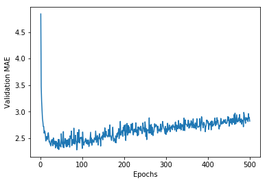
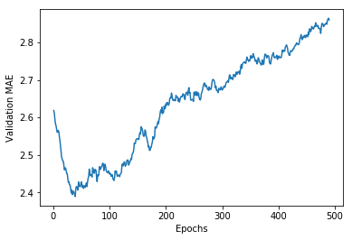

```python
#加载波士顿房价数据
from keras.datasets import boston_housing
(train_data, train_targets), (test_data, test_targets) = boston_housing.load_data()
```

```
Using TensorFlow backend.
```

```
Downloading data from https://s3.amazonaws.com/keras-datasets/boston_housing.npz
57344/57026 [==============================] - 1s 10us/step
```

<!-- more -->

```python
train_data.shape
```


```
(404, 13)
```


```python
test_data.shape
```


```
(102, 13)
```


```python
train_targets
```


```
array([15.2, 42.3, 50. , 21.1, 17.7, 18.5, 11.3, 15.6, 15.6, 14.4, 12.1,
       17.9, 23.1, 19.9, 15.7,  8.8, 50. , 22.5, 24.1, 27.5, 10.9, 30.8,
       32.9, 24. , 18.5, 13.3, 22.9, 34.7, 16.6, 17.5, 22.3, 16.1, 14.9,
       23.1, 34.9, 25. , 13.9, 13.1, 20.4, 20. , 15.2, 24.7, 22.2, 16.7,
       12.7, 15.6, 18.4, 21. , 30.1, 15.1, 18.7,  9.6, 31.5, 24.8, 19.1,
       22. , 14.5, 11. , 32. , 29.4, 20.3, 24.4, 14.6, 19.5, 14.1, 14.3,
       15.6, 10.5,  6.3, 19.3, 19.3, 13.4, 36.4, 17.8, 13.5, 16.5,  8.3,
       14.3, 16. , 13.4, 28.6, 43.5, 20.2, 22. , 23. , 20.7, 12.5, 48.5,
       14.6, 13.4, 23.7, 50. , 21.7, 39.8, 38.7, 22.2, 34.9, 22.5, 31.1,
       28.7, 46. , 41.7, 21. , 26.6, 15. , 24.4, 13.3, 21.2, 11.7, 21.7,
       19.4, 50. , 22.8, 19.7, 24.7, 36.2, 14.2, 18.9, 18.3, 20.6, 24.6,
       18.2,  8.7, 44. , 10.4, 13.2, 21.2, 37. , 30.7, 22.9, 20. , 19.3,
       31.7, 32. , 23.1, 18.8, 10.9, 50. , 19.6,  5. , 14.4, 19.8, 13.8,
       19.6, 23.9, 24.5, 25. , 19.9, 17.2, 24.6, 13.5, 26.6, 21.4, 11.9,
       22.6, 19.6,  8.5, 23.7, 23.1, 22.4, 20.5, 23.6, 18.4, 35.2, 23.1,
       27.9, 20.6, 23.7, 28. , 13.6, 27.1, 23.6, 20.6, 18.2, 21.7, 17.1,
        8.4, 25.3, 13.8, 22.2, 18.4, 20.7, 31.6, 30.5, 20.3,  8.8, 19.2,
       19.4, 23.1, 23. , 14.8, 48.8, 22.6, 33.4, 21.1, 13.6, 32.2, 13.1,
       23.4, 18.9, 23.9, 11.8, 23.3, 22.8, 19.6, 16.7, 13.4, 22.2, 20.4,
       21.8, 26.4, 14.9, 24.1, 23.8, 12.3, 29.1, 21. , 19.5, 23.3, 23.8,
       17.8, 11.5, 21.7, 19.9, 25. , 33.4, 28.5, 21.4, 24.3, 27.5, 33.1,
       16.2, 23.3, 48.3, 22.9, 22.8, 13.1, 12.7, 22.6, 15. , 15.3, 10.5,
       24. , 18.5, 21.7, 19.5, 33.2, 23.2,  5. , 19.1, 12.7, 22.3, 10.2,
       13.9, 16.3, 17. , 20.1, 29.9, 17.2, 37.3, 45.4, 17.8, 23.2, 29. ,
       22. , 18. , 17.4, 34.6, 20.1, 25. , 15.6, 24.8, 28.2, 21.2, 21.4,
       23.8, 31. , 26.2, 17.4, 37.9, 17.5, 20. ,  8.3, 23.9,  8.4, 13.8,
        7.2, 11.7, 17.1, 21.6, 50. , 16.1, 20.4, 20.6, 21.4, 20.6, 36.5,
        8.5, 24.8, 10.8, 21.9, 17.3, 18.9, 36.2, 14.9, 18.2, 33.3, 21.8,
       19.7, 31.6, 24.8, 19.4, 22.8,  7.5, 44.8, 16.8, 18.7, 50. , 50. ,
       19.5, 20.1, 50. , 17.2, 20.8, 19.3, 41.3, 20.4, 20.5, 13.8, 16.5,
       23.9, 20.6, 31.5, 23.3, 16.8, 14. , 33.8, 36.1, 12.8, 18.3, 18.7,
       19.1, 29. , 30.1, 50. , 50. , 22. , 11.9, 37.6, 50. , 22.7, 20.8,
       23.5, 27.9, 50. , 19.3, 23.9, 22.6, 15.2, 21.7, 19.2, 43.8, 20.3,
       33.2, 19.9, 22.5, 32.7, 22. , 17.1, 19. , 15. , 16.1, 25.1, 23.7,
       28.7, 37.2, 22.6, 16.4, 25. , 29.8, 22.1, 17.4, 18.1, 30.3, 17.5,
       24.7, 12.6, 26.5, 28.7, 13.3, 10.4, 24.4, 23. , 20. , 17.8,  7. ,
       11.8, 24.4, 13.8, 19.4, 25.2, 19.4, 19.4, 29.1])

```


```python
#数据特征标准化  （特征-平均值）/标准差
mean = train_data.mean(axis=0)   #特征平均值
train_data -= mean
std = train_data.std(axis=0)   #标准差
train_data /= std

test_data -= mean
test_data /= std

```

```python
#构建网络 模型定义
from keras import models
from keras import layers

#需要将同一个模型多次实例化，所以用一个函数来构建模型
#MSE损失函数（mean squared error）：均方误差，预测值与目标值之差的平方
#MAE指标（mean absolute error）：平均绝对误差，预测值与目标值之差的绝对值
def build_model():
    model = models.Sequential()
    model.add(layers.Dense(64, activation='relu', input_shape=(train_data.shape[1], )))
    model.add(layers.Dense(64, activation='relu'))
    model.add(layers.Dense(1))   #没有激活，线性层
    model.compile(optimizer='rmsprop', loss='mse', metrics=['mae'])
    return model

```

```python
#K折交叉验证
import numpy as np

k = 4
num_val_samples = len(train_data) // k
num_epochs = 100   #训练100轮次
all_scores = []

for i in range(k):
    print('processing fold #', i)
    #准备验证数据：第k个分区的数据
    val_data = train_data[i * num_val_samples: (i + 1) * num_val_samples]
    val_targets = train_targets[i * num_val_samples: (i + 1) * num_val_samples]
    #准备训练数据：其他所有分区的数据
    partial_train_data = np.concatenate(
        [train_data[:i * num_val_samples],
         train_data[(i + 1) * num_val_samples: ]],
        axis=0
    )
    partial_train_targets = np.concatenate(
        [train_targets[:i * num_val_samples],
         train_targets[(i + 1) * num_val_samples: ]],
        axis=0
    )
    #构建Keras模型（已编译）
    model = build_model()
    #训练模型（静默模式，verbose=0）
    model.fit(partial_train_data, partial_train_targets,
             epochs=num_epochs, batch_size=1, verbose=0)
    在验证数据上评估模型
    val_mse, val_mae = model.evaluate(val_data, val_targets, verbose=0)
    all_scores.append(val_mae)

```

```
processing fold # 0
processing fold # 1
processing fold # 2
processing fold # 3

```


```python
all_scores

```


```
[1.953495462342064, 2.7316349308089456, 2.4950007542525188, 2.304117675464932]

```


```python
np.mean(all_scores)
#差别很大

```


```
2.371062205717115

```


```python
#重新训练 500轮次
#保存每折的验证结果
num_epochs = 500
all_mae_histories = []
for i in range(k):
    print('processing fold #', i)
    val_data = train_data[i * num_val_samples: (i + 1) * num_val_samples]
    val_targets = train_targets[i * num_val_samples: (i + 1) * num_val_samples]
    
    partial_train_data = np.concatenate(
    [train_data[:i * num_val_samples],
     train_data[(i + 1) * num_val_samples: ]],
    axis=0
    )
    
    partial_train_targets = np.concatenate(
    [train_targets[:i * num_val_samples],
     train_targets[(i + 1) * num_val_samples: ]],
    axis=0
    )
    
    model = build_model()
    history = model.fit(partial_train_data, partial_train_targets,
                               validation_data=(val_data, val_targets),
                               epochs=num_epochs, batch_size=1, verbose=0)
    mae_history = history.history['val_mean_absolute_error']
    all_mae_histories.append(mae_history)

```

```
processing fold # 0
processing fold # 1
processing fold # 2
processing fold # 3

```


```python
#计算所有轮次中的K折验证分数平均值
average_mae_history = [
    np.mean([x[i] for x in all_mae_histories]) for i in range(num_epochs)]

```

```python
#绘制验证分数 纵轴范围较大，数据方差相对较大，难以看清规律，重新绘制
import matplotlib.pyplot as plt

plt.plot(range(1, len(average_mae_history) + 1), average_mae_history)
plt.xlabel('Epochs')
plt.ylabel('Validation MAE')
plt.show()

```




```python
#重新绘制：删除前10个数据点，将每个数据点替换为前面数据点的指数移动平均值
def smooth_curve(points, factor=0.9):
    smoothed_points = []
    for point in points:
        if smoothed_points:
            previous = smoothed_points[-1]
            smoothed_points.append(previous * factor + point * (1 - factor))
        else:
            smoothed_points.append(point)
    return smoothed_points

smooth_mae_history = smooth_curve(average_mae_history[10: ])

plt.plot(range(1, len(smooth_mae_history) + 1), smooth_mae_history)
plt.xlabel('Epochs')
plt.ylabel('Validation MAE')
plt.show()

```




```python
#上一轮出现过拟合
#训练最终模型
model = build_model()
model.fit(train_data, train_targets, epochs=80, batch_size=16, verbose=0)
test_mse_score, test_mae_score = model.evaluate(test_data, test_targets)
```

```
102/102 [==============================] - 0s 2ms/step
```


```python
#最终结果
test_mae_score
```


```
2.577465954948874
```


```python
test_mse_score
```


```
16.48435390696806
```


```python

```