Intellij IDEA插件开发有两种方式：

* Gradle
* Plugin Devkit

本文根据官方推荐使用Gradle。

## 1. 插件开发环境

* IDEA: 社区版本
* Project JDK: 1.8
* Gradle: 4.10

<!-- more -->

## 2. 确认Gradle可用

菜单Preferences -> Plugins

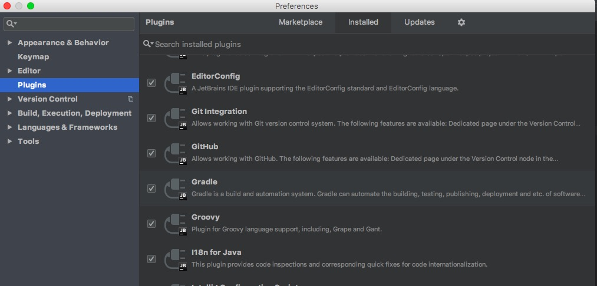

## 3. 创建Plugin项目

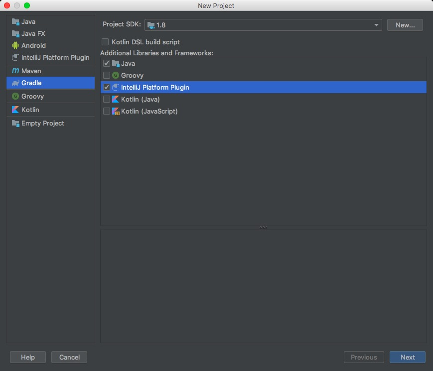

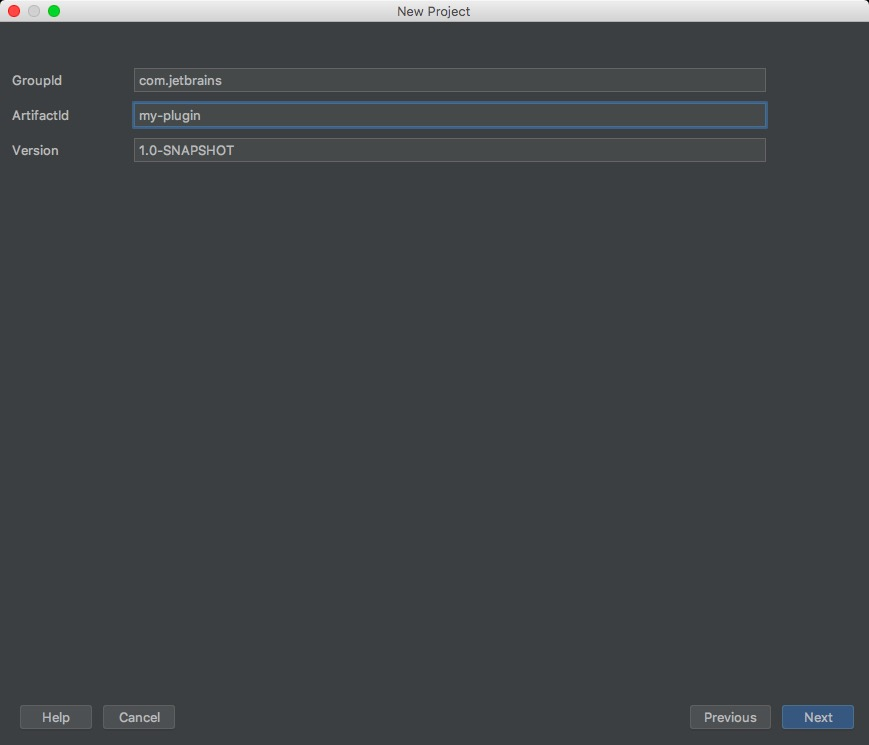

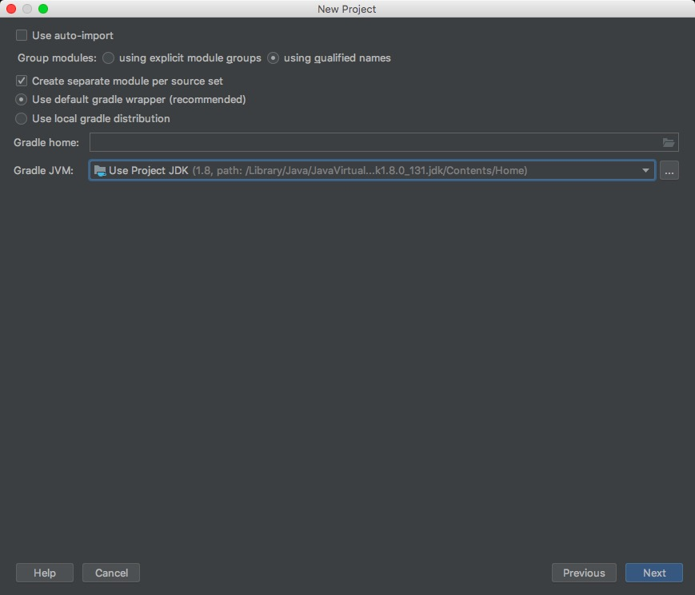

（官方推荐勾选“Use default cradle wrapper”，以便IDEA自动安装Gradle需要的包）

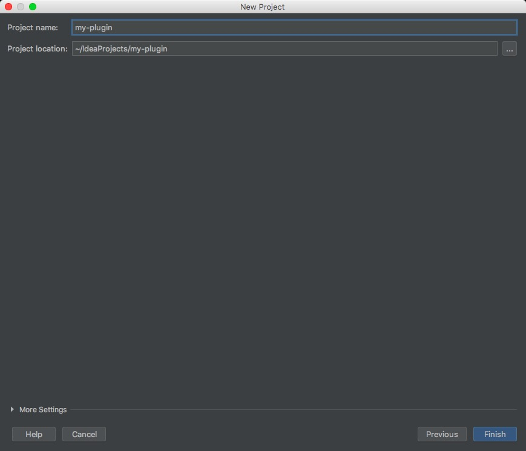

项目创建完成。

**工程结构：**

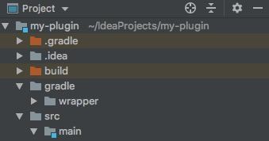

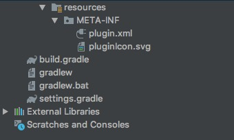

**plugin.xml文件内容：**

* id：当前插件的唯一id号。
* name：插件的名称。
* version：插件的版本号。
* vendor：开发人的邮箱、公司名称。
* description：插件的描述，如果将插件上传到IDEA的仓库，在进行下载时会显示该描述。
* idea-version：表示当前插件所支持的所有IDEA版本。
* extensions：一般放一些我们自己扩展的东西，比如新增高亮显示、新增语言支持。
* actions：新增的类在这里注册，用于菜单栏扩展。

## 4. 配置Gradle插件

在build.gradle文件中，设置运行插件的沙箱地址。

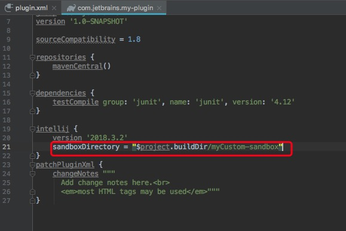

## 5. 创建一个action

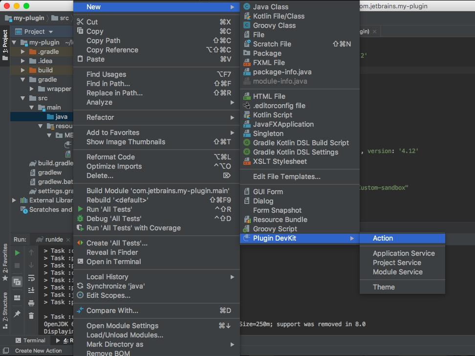

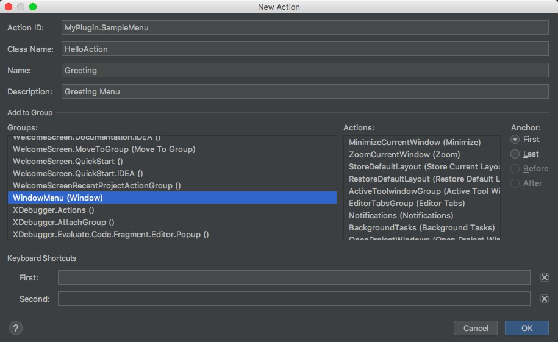

自定义功能加在Window菜单栏下。

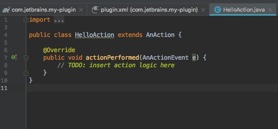

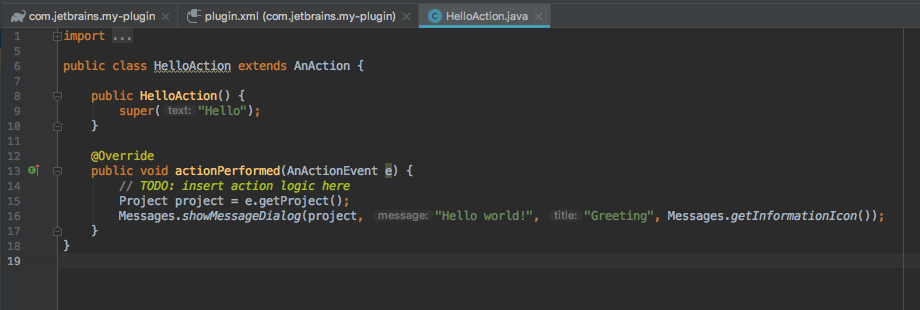

在plugin.xml文件中，项目自动生成action配置：

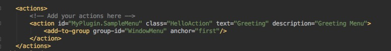

## 6. Gradle运行配置

菜单Edit Configurations -> Run/Debug Configurations

点击'+'号，新建Gradle Run Configuration。

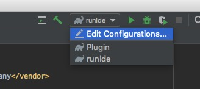

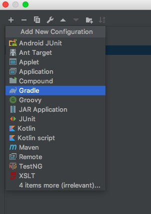

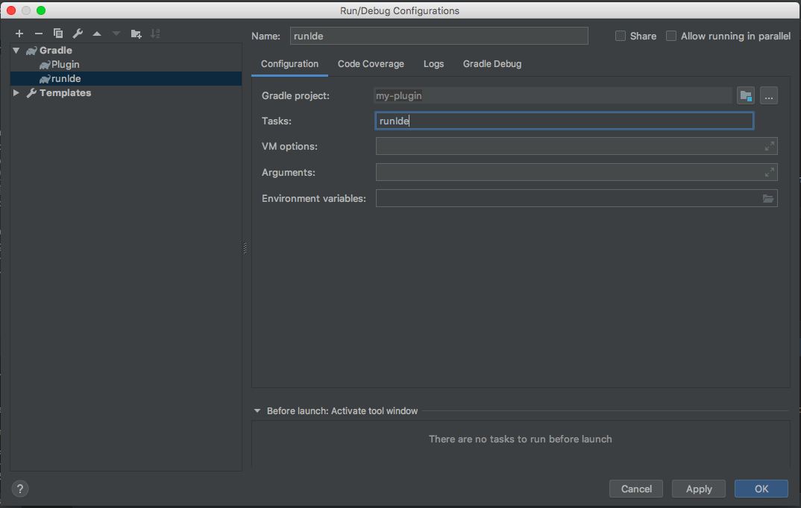

## 7. 运行项目

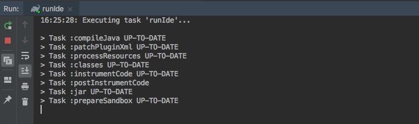

在Window菜单栏加入我们自定义的'Greeting'选项，点击弹出'Hello World!'。

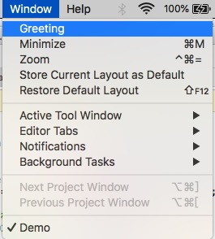

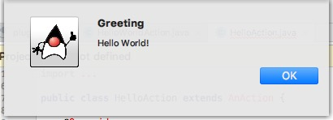

## 8. 打包插件

参考文献：

IDEA官方插件开发手册http://www.jetbrains.org/intellij/sdk/docs/basics.html

